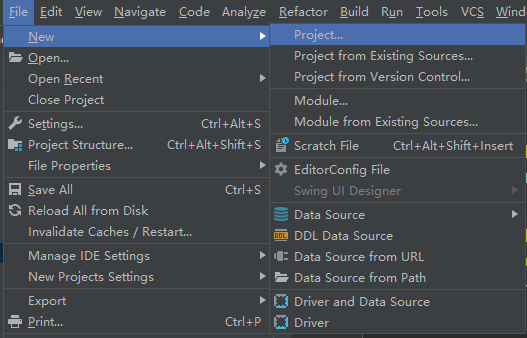
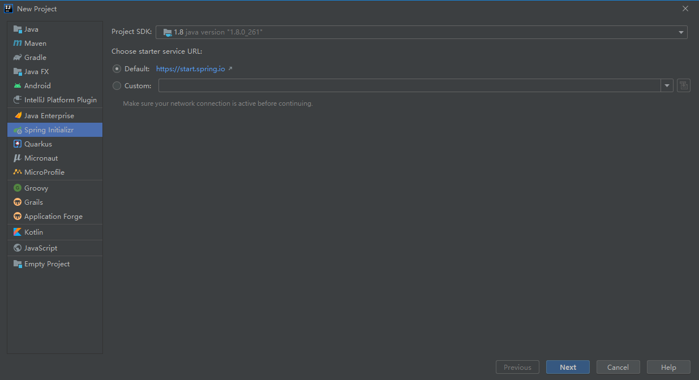
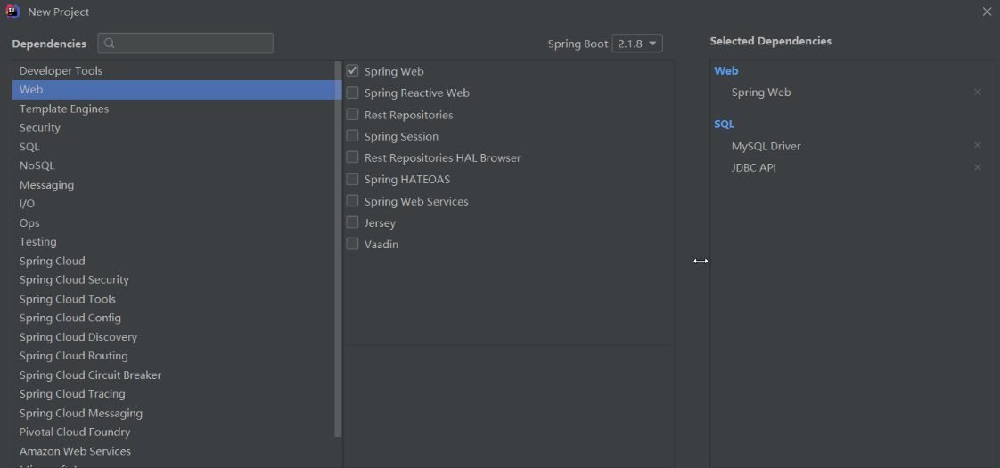
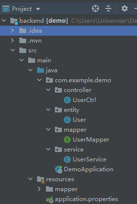
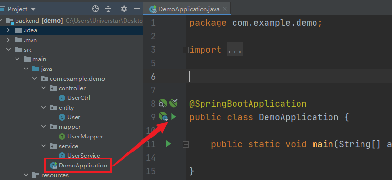
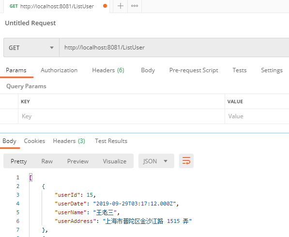
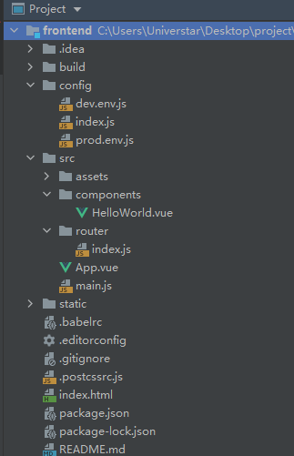

[toc]

# SpringBoot-Vue实现增删改查及分页小DEMO

## 一、前言

主要通过`后端Spring Boot技术`和`前端Vue技术`来简单开发一个demo，实现增删改查、分页功能以及了解SpringBoot搭配Vue完成**前后端分离项目**的开发流程。
## 二、开发栈
##### 前端
- 开发工具：IDEA + Vue.js插件
- 开发框架：Vue CLI 2.0 + axios
- 包管理工具: npm
- 打包工具：webpack

##### 后端
- 开发工具：IDEA
- 开发框架：SpringBoot + MyBatis 
- 打包工具：Maven
- 数据库： MySQL5.7 

## 三、后端开发环境搭建
1. File->New->Project...
   
2. 选择 Spring Initializr ，然后选择默认的 url 点击next



3. 勾选Spring Web、SQL模板，next



4. 点击finish，搭建完成

## 四、后端开发过程
1. 更新 `pom.xml`

```xml
<?xml version="1.0" encoding="UTF-8"?>
<project xmlns="http://maven.apache.org/POM/4.0.0" xmlns:xsi="http://www.w3.org/2001/XMLSchema-instance"
         xsi:schemaLocation="http://maven.apache.org/POM/4.0.0 http://maven.apache.org/xsd/maven-4.0.0.xsd">
    <modelVersion>4.0.0</modelVersion>

    <groupId>com.example</groupId>
    <artifactId>demo</artifactId>
    <version>0.0.1-SNAPSHOT</version>
    <name>springboot-mybatis</name>

    <!-- Spring Boot 启动父依赖 -->
    <parent>
        <groupId>org.springframework.boot</groupId>
        <artifactId>spring-boot-starter-parent</artifactId>
        <version>2.1.3.RELEASE</version>
    </parent>

    <properties>
        <mybatis-spring-boot>1.2.0</mybatis-spring-boot>
        <mysql-connector>5.1.39</mysql-connector>
    </properties>

    <dependencies>

        <!-- Spring Boot Web 依赖 -->
        <dependency>
            <groupId>org.springframework.boot</groupId>
            <artifactId>spring-boot-starter-web</artifactId>
        </dependency>

        <!-- Spring Boot Test 依赖 -->
        <dependency>
            <groupId>org.springframework.boot</groupId>
            <artifactId>spring-boot-starter-test</artifactId>
            <scope>test</scope>
        </dependency>

        <!-- Spring Boot Mybatis 依赖 -->
        <dependency>
            <groupId>org.mybatis.spring.boot</groupId>
            <artifactId>mybatis-spring-boot-starter</artifactId>
            <version>${mybatis-spring-boot}</version>
        </dependency>

        <!-- MySQL 连接驱动依赖 -->
        <dependency>
            <groupId>mysql</groupId>
            <artifactId>mysql-connector-java</artifactId>
            <version>${mysql-connector}</version>
        </dependency>

        <!-- Junit -->
        <dependency>
            <groupId>junit</groupId>
            <artifactId>junit</artifactId>
            <version>4.12</version>
        </dependency>
    </dependencies>
</project>
```
2. 更新 `application.properties`

```properties
## 数据源配置
spring.datasource.url=jdbc:mysql://localhost/forprac?useUnicode=true&characterEncoding=utf8
spring.datasource.username=root
spring.datasource.password=123456
spring.datasource.driver-class-name=com.mysql.jdbc.Driver

## Mybatis 配置
mybatis.typeAliasesPackage=org.spring.springboot.domain
mybatis.mapperLocations=classpath:mapper/*.xml

## 端口
server.port=8081
```

3. 新建 Pojo类：`User.java`

```java
package com.example.demo.entity;

public class User {
    private int userId;
    private String userDate;
    private String userName;
    private String userAddress;

   //省略get() set()
}
```
4. 新建 `UserMapper.java`

```java
package com.example.demo.mapper;

import com.example.demo.entity.User;
import org.apache.ibatis.annotations.Mapper;

import java.util.List;

Mapper
public interface UserMapper {

    public List<User> findUserByName(String userName);

    public List<User> ListUser();

    public List<User> queryPage(Integer startRows);

    public int getRowCount();

    public int insertUser(User user);

    public int delete(int userId);

    public int Update(User user);
}
```
5. 新建 `UserMapper.xml`

```xml
<?xml version = "1.0" encoding = "UTF-8"?>
<!DOCTYPE mapper PUBLIC
        "-//mybatis.org//DTD com.example.Mapper 3.0//EN"
        "http://mybatis.org/dtd/mybatis-3-mapper.dtd">
<mapper namespace="com.example.demo.mapper.UserMapper">

    <resultMap id="result" type="com.example.demo.entity.User">
        <result property="userId" column="userId" />
		<result property="userDate" column="userDate" />
        <result property="userName" column="userName" />
        <result property="userAddress" column="userAddress"/>
    </resultMap>

    <select id="ListUser" resultMap="result">
		SELECT * FROM user
	</select>

    <select id="findUserByName" resultMap="result" parameterType="String">
		SELECT * FROM user
			where userName like concat(concat('%',#{userName}),'%')
			order by userId desc
	</select>

	<select id="queryPage" resultMap="result"  parameterType="Integer">
		select * from user
			order by userId desc
			limit #{startRows},5
	</select>

	<select id="getRowCount" resultType="Integer">
		select count(*) from user
	</select>

    <insert id="insertUser" parameterType="com.example.demo.entity.User">
		INSERT INTO user
		(
		userId,userDate,userName,userAddress
		)
		VALUES (
		#{userId},
		#{userDate, jdbcType=VARCHAR},
		#{userName, jdbcType=VARCHAR},
		#{userAddress, jdbcType=VARCHAR}
		)
	</insert>

    <delete id="delete" parameterType="int">
		delete from user where userId=#{userId}
	</delete>

    <update id="Update" parameterType="com.example.demo.entity.User">
		update user
			set user.userDate=#{userDate},user.userName=#{userName},user.userAddress=#{userAddress}
			where user.userId=#{userId}
	</update>
</mapper>
```
6.  新建 `UserService.java`

```java
package com.example.demo.service;

import com.example.demo.entity.User;
import com.example.demo.mapper.UserMapper;
import org.springframework.beans.factory.annotation.Autowired;
import org.springframework.stereotype.Service;

import java.util.List;


Service
public class UserService {

    @Autowired
    private UserMapper userMapper;

    public List<User> findByName(String userName) {
        return userMapper.findUserByName(userName);
    }

    public List<User> queryPage(Integer startRows) {
        return userMapper.queryPage(startRows);
    }

    public int getRowCount() {
        return userMapper.getRowCount();
    }

    public User insertUser(User user) {
        userMapper.insertUser(user);
        return user;
    }

    public List<User> ListUser(){
        return userMapper.ListUser();
    }

    public int Update(User user){
        return userMapper.Update(user);
    }

    public int delete(int userId){
        return userMapper.delete(userId);
    }

}
```
7. 新建 `UserCtrl.java`

```java
package com.example.demo.controller;

import com.example.demo.entity.User;
import com.example.demo.service.UserService;
import org.springframework.beans.factory.annotation.Autowired;
import org.springframework.web.bind.annotation.*;

import java.util.List;

@RestController
public class UserCtrl {

    @Autowired
    private UserService userService;

    @RequestMapping(value = "/delete", method = RequestMethod.POST)
    public Integer delete(Integer userId) {
        System.out.println(userId);
        int result = userService.delete(userId);
        return result;
    }

    @RequestMapping(value = "/update", method = RequestMethod.POST)
    @ResponseBody
    public String update(User user) {
        int result = userService.Update(user);
        if (result >= 1) {
            return "修改成功";
        } else {
            return "修改失败";
        }

    }

    @RequestMapping(value = "/insert", method = RequestMethod.POST)
    public User insert(User user) {
        return userService.insertUser(user);
    }

    @RequestMapping("/ListUser")
    @ResponseBody
    public List<User> ListUser() {
        return userService.ListUser();
    }

    @RequestMapping("/ListByName")
    @ResponseBody
    public List<User> ListUserByName(String userName) {
        return userService.findByName(userName);
    }

    /**
     * 分页
     * @return
     */
    @RequestMapping(value="/page")
    @ResponseBody
    public List<User> page(Integer page){
        int pageNow = page == null ? 1 : page;
        int pageSize = 5;
        int startRows = pageSize*(pageNow-1);
        List<User> list = userService.queryPage(startRows);
        return list;
    }

    /**
     * rows
     * @return
     */
    @RequestMapping(value="/rows")
    @ResponseBody
    public int rows(){
        return userService.getRowCount();
    }
}
```
8. 启动SQLyog，新增测试数据

```sql
SET NAMES utf8mb4;
SET FOREIGN_KEY_CHECKS = 0;

-- ----------------------------
-- Table structure for user
-- ----------------------------
DROP TABLE IF EXISTS `user`;
CREATE TABLE `user`  (
  `userId` int(20) NOT NULL AUTO_INCREMENT,
  `userDate` varchar(100) CHARACTER SET utf8 COLLATE utf8_general_ci NOT NULL,
  `userName` varchar(100) CHARACTER SET utf8 COLLATE utf8_general_ci NOT NULL,
  `userAddress` varchar(255) CHARACTER SET utf8 COLLATE utf8_general_ci NOT NULL,
  PRIMARY KEY (`userId`) USING BTREE
) ENGINE = InnoDB AUTO_INCREMENT = 71 CHARACTER SET = utf8 COLLATE = utf8_general_ci ROW_FORMAT = Compact;

-- ----------------------------
-- Records of user
-- ----------------------------
INSERT INTO `user` VALUES (15, '2019-09-29T03:17:12.000Z', '王老三', '上海市普陀区金沙江路 1515 弄');
INSERT INTO `user` VALUES (16, '2019-09-29T03:27:05.000Z', '张小四', '上海市普陀区金沙江路 1514 弄');
INSERT INTO `user` VALUES (17, '2019-09-29T03:30:04.000Z', '王老五', '上海市普陀区金沙江路 1513弄');
INSERT INTO `user` VALUES (18, '2019-09-29T03:33:15.000Z', '小六子', '上海市普陀区金沙江路 1512弄');
INSERT INTO `user` VALUES (20, '2019-09-29T03:33:15.000Z', '王老八', '上海市普陀区金沙江路 1512弄');
INSERT INTO `user` VALUES (21, '2019-09-29T05:42:52.000Z', '王大拿', '上海市普陀区金沙江路 1511弄');
INSERT INTO `user` VALUES (22, '2019-09-29T05:43:50.000Z', '小九九', '上海市普陀区金沙江路 1510弄');
INSERT INTO `user` VALUES (23, '2019-09-29T05:43:50.000Z', '刘诗诗', '上海市普陀区金沙江路 1499弄');
INSERT INTO `user` VALUES (24, '2019-09-29T05:46:07.000Z', '扎昂四四', '上海市大湾区科技路');
INSERT INTO `user` VALUES (25, '2019-09-29T05:46:07.000Z', '扎昂四四新东方', '上海市大湾区科技路2001号');
INSERT INTO `user` VALUES (26, '2019-09-29T05:46:07.000Z', '王小虎', '上海市大湾区科技路2002号');
INSERT INTO `user` VALUES (27, '2019-09-29T05:46:07.000Z', '抽拉吧唧', '上海市大湾区科技路2003号');
INSERT INTO `user` VALUES (28, '2019-09-29T05:46:07.000Z', '年啦编辑', '上海市大湾区科技路2004号');
INSERT INTO `user` VALUES (29, '2019-09-29T05:46:07.000Z', '你多少', '上海市普陀区金沙江路 1211弄');
INSERT INTO `user` VALUES (30, '2019-09-29T05:46:07.000Z', '反发达', '上海市普陀区金沙江路 1212弄');
INSERT INTO `user` VALUES (31, '2019-09-29T05:51:20.000Z', '发官方', '上海市普陀区金沙江路 1213弄');
INSERT INTO `user` VALUES (32, '2019-09-29T05:51:20.000Z', '方还有', '上海市普陀区金沙江路 1214弄');
INSERT INTO `user` VALUES (33, '2019-09-29T05:51:20.000Z', '过不分', '上海市普陀区金沙江路 1498弄');
INSERT INTO `user` VALUES (34, '2019-09-29T05:51:20.000Z', '菜市场', '上海市普陀区金沙江路 1497弄');
INSERT INTO `user` VALUES (35, '2019-09-29T05:51:20.000Z', '权威的', '上海市普陀区金沙江路 1496弄');
INSERT INTO `user` VALUES (36, '2019-09-29T05:55:09.000Z', '冈反对的', '上海市大湾区科技路2001号');
INSERT INTO `user` VALUES (37, '2019-09-29T05:55:09.000Z', '冈反对', '上海市大湾区科技路2003号');
INSERT INTO `user` VALUES (38, '2019-09-29T05:55:09.000Z', '偶哦里面', '上海市大湾区科技路2004号');
INSERT INTO `user` VALUES (39, '2019-09-29T05:55:09.000Z', '偶哦韩大苏打', '上海市大湾区科技路2005号');
INSERT INTO `user` VALUES (40, '2019-09-29T05:55:09.000Z', '偶哦匀', '上海市大湾区科技路2006号');
INSERT INTO `user` VALUES (41, '2019-09-29T05:55:09.000Z', '敢哦匀', '上海市大湾区科技路2006号');
INSERT INTO `user` VALUES (42, '2019-09-29T05:55:09.000Z', '敢孩', '上海市大湾区科技路2006号');
INSERT INTO `user` VALUES (43, '2019-09-29T05:55:09.000Z', '敢女孩', '上海市大湾区科技路2007号');
INSERT INTO `user` VALUES (45, '2019-09-29T05:55:09.000Z', '工行行', '上海市大湾区科技路2008号');
INSERT INTO `user` VALUES (46, '2019-09-29T05:55:09.000Z', '家好吗', '上海市大湾区科技路2008号');
INSERT INTO `user` VALUES (47, '2019-09-29T05:55:09.000Z', '的程度', '上海市大湾区科技路2009号');
INSERT INTO `user` VALUES (48, '2019-09-29T05:55:09.000Z', '称得上', '上海市大湾区科技路2009号');
INSERT INTO `user` VALUES (49, '2019-09-29T05:55:09.000Z', '韩国和', '上海市大湾区科技路2010号');
INSERT INTO `user` VALUES (50, '2019-09-29T05:55:09.000Z', '韩好', '上海市大湾区科技路2010号');
INSERT INTO `user` VALUES (51, '2019-09-29T05:55:09.000Z', '韩吧', '上海市大湾区科技路2011号');
INSERT INTO `user` VALUES (52, '2019-09-29T05:55:09.000Z', '韩吧吧', '上海市大湾区科技路2012号');
INSERT INTO `user` VALUES (53, '2019-09-29T05:55:09.000Z', '长度是', '上海市大湾区科技路2013号');
INSERT INTO `user` VALUES (54, '2019-09-29T05:55:09.000Z', '比如合', '上海市大湾区科技路2014号');
INSERT INTO `user` VALUES (55, '2019-09-29T05:55:09.000Z', '如合境', '上海市大湾区科技路2015号');
INSERT INTO `user` VALUES (56, '2019-09-29T05:55:09.000Z', '如合国', '上海市大湾区科技路2016号');
INSERT INTO `user` VALUES (57, '2019-09-29T05:55:09.000Z', '如更好', '上海市大湾区科技路2017号');
INSERT INTO `user` VALUES (58, '2019-09-29T05:55:09.000Z', '如更法', '上海市大湾区科技路2018号');
INSERT INTO `user` VALUES (59, '2019-09-29T05:55:09.000Z', '反对', '上海市大湾区科技路2019号');
INSERT INTO `user` VALUES (60, '2019-09-29T05:55:09.000Z', '如国部', '上海市大湾区科技路2019号');
INSERT INTO `user` VALUES (61, '2019-09-29T06:04:15.000Z', '奇热网', '上海市普陀区金沙江路 1496弄');
INSERT INTO `user` VALUES (62, '2019-09-29T06:04:33.000Z', '反对法', '上海市普陀区金沙江路 1495弄');
INSERT INTO `user` VALUES (63, '2019-09-29T06:04:33.000Z', '的风格', '上海市普陀区金沙江路 1494弄');
INSERT INTO `user` VALUES (64, '2019-09-29T06:04:33.000Z', '广泛同', '上海市大湾区科技路2020号');
INSERT INTO `user` VALUES (65, '2019-09-10T06:04:33.000Z', '但仍然', '上海市普陀区金沙江路 1493弄');
INSERT INTO `user` VALUES (66, '2019-09-29T06:10:28.000Z', 'vdfv', '放到电饭锅的');
INSERT INTO `user` VALUES (67, '2019-09-14T16:00:00.000Z', '朱老六', '上海市高新区上海中心');
INSERT INTO `user` VALUES (69, '2019-09-10T16:00:00.000Z', '是的', ' 学生的三十四分');
INSERT INTO `user` VALUES (70, '2019-09-29T07:51:44.000Z', '张小子', '上海市浦东区1234号');

SET FOREIGN_KEY_CHECKS = 1;
```
9. 后端整体结构如下：



10. 测试后端项目是否搭建成功

① 启动后端项目



run 主启动类`DemoApplication`

② 测试接口

若控制台没报错就用Postman测试一下各个方法


## 五、前端开发环境搭建
1. win+R->cmd->进入项目目录依次执行命令：`vue init webpack projectName`、`cd projectName`、`npm install`、`npm run dev`
2. IDEA先装好Vue.js插件，然后打开刚初始化的项目
3. Vue-cli项目结构如图：



## 六、前端开发过程
1. 安装插件 样式模板库`ElementUI` 和 前后端通信的插件`axios`

项目根目录安装axios执行命令

```cmd
npm install axios
npm i element-ui -S
```

2. 更新 `App.vue`

```vue
<template>
  <div id="app">
    <el-row type="flex" justify="center">
      <el-col :xs="24" :sm="22" :md="20" :lg="20" :xl="18">
        <router-view/>
      </el-col>
    </el-row>
  </div>
</template>

<script>
    export default {
        name: 'App',
        data() {
            return {
            }
        },
        methods: {
        }
    }
</script>

<style>
  #app {
    font-family: 'Avenir', Helvetica, Arial, sans-serif;
    -webkit-font-smoothing: antialiased;
    -moz-osx-font-smoothing: grayscale;
    margin: 0px;
    padding: 0px;
  }
</style>
```
3. 更新 `main.js`

```js
// The Vue build version to load with the `import` command
// (runtime-only or standalone) has been set in webpack.base.conf with an alias.
import Vue from 'vue'
import App from './App'
import router from './router'
import elementUI from 'element-ui'
import 'element-ui/lib/theme-chalk/index.css'
import 'element-ui/lib/theme-chalk/display.css'

Vue.use(elementUI)

import axios from 'axios'
Vue.prototype.axios = axios

import qs from 'qs';
Vue.prototype.qs = qs;

Vue.config.productionTip = false

/* eslint-disable no-new */
new Vue({
  el: '#app',
  router,
  components: { App },
  template: '<App/>'
})
```
4. 更新 `HelloWorld.vue`

```vue
<template>
  <div>
      <el-form :inline="true" class="demo-form-inline">
          <el-form-item>
            <el-input
              v-model="search"
              class="search_name"
              size="mini"
              placeholder="输入姓名查询">
            </el-input>
          </el-form-item>
          <el-form-item>
            <el-button
              type="text"
              @click="onSearch()"
              class="el-icon-search">查询
            </el-button>
          </el-form-item>
          <el-form-item>
            <el-button
              class="el-icon-refresh"
              type="text"
              @click="refreshData">刷新
            </el-button>
          </el-form-item>
          <el-form-item>
            <el-button
              class="el-icon-circle-plus-outline"
              type="text"
              @click="dialogVisible = true">添加
            </el-button>
          </el-form-item>
      </el-form>
      <el-table
        :data="tableData"
        highlight-current-row
        border
        style="width: 100%">
        <el-table-column
          label="编号">
          <template slot-scope="scope">
            <span>{{ scope.row.userId }}</span>
          </template>
        </el-table-column>
        <el-table-column
          label="日期">
          <template slot-scope="scope">
            <i class="el-icon-time hidden-sm-and-down"></i>
            <span>{{ scope.row.userDate }}</span>
          </template>
        </el-table-column>
        <el-table-column
          label="姓名">
          <template slot-scope="scope">
            <el-popover trigger="hover" placement="right">
              <p>姓名: {{ scope.row.userName }}</p>
              <p>住址: {{ scope.row.userAddress }}</p>
              <p>日期：{{ scope.row.userDate }}</p>
              <div slot="reference" class="name-wrapper">
                <el-button type="text">{{ scope.row.userName }}</el-button>
              </div>
            </el-popover>
          </template>
        </el-table-column>
        <el-table-column
          label="住址">
          <template slot-scope="scope">
            <span>{{ scope.row.userAddress }}</span>
          </template>
        </el-table-column>
        <el-table-column
          label="操作"
          fixed="right"
          width="200">
          <template slot-scope="scope">
            <el-button
              size="mini"
              icon="el-icon-edit"
              @click="handleEdit(scope.$index, scope.row)">编辑
            </el-button>
            <el-button
              size="mini"
              type="danger"
              icon="el-icon-delete"
              @click="handleDelete(scope.$index, scope.row)">删除
            </el-button>
          </template>
        </el-table-column>
      </el-table>

      <el-form :model="ruleForm" :rules="rules" ref="ruleForm" label-width="70px" class="demo-ruleForm" size="medium">
        <el-dialog
          title="添加"
          :append-to-body='true'
          :visible.sync="dialogVisible"
          width="80%"
          :before-close="handleClose">
          <el-input type="hidden" v-model="ruleForm.userId"/>
          <el-form-item label="时间" prop="userDate">
            <el-date-picker type="datetime" placeholder="选择日期" v-model="ruleForm.userDate" style="width: 100%;"></el-date-picker>
          </el-form-item>
          <el-form-item label="姓名" prop="userName">
            <el-input v-model="ruleForm.userName"></el-input>
          </el-form-item>
          <el-form-item label="住址" prop="userAddress">
            <el-input v-model="ruleForm.userAddress"></el-input>
          </el-form-item>

          <span slot="footer" class="dialog-footer">
            <el-button @click="cancel()" size="medium">取 消</el-button>
            <el-button @click="addUser()" type="primary" size="medium">确 定</el-button>
          </span>
        </el-dialog>
      </el-form>

    <el-form :model="ruleForm" :rules="rules" ref="ruleForm" label-width="70px" class="demo-ruleForm" size="medium">
      <el-dialog
        title="编辑"
        :append-to-body='true'
        :visible.sync="dialogUpdate"
        width="80%"
        :before-close="handleClose">
        <el-input type="hidden" v-model="ruleForm.userId"/>
        <el-form-item label="时间" prop="userDate">
          <el-date-picker type="datetime" placeholder="选择日期" v-model="ruleForm.userDate" style="width: 100%;"></el-date-picker>
        </el-form-item>
        <el-form-item label="姓名" prop="userName">
          <el-input v-model="ruleForm.userName"></el-input>
        </el-form-item>
        <el-form-item label="住址" prop="userAddress">
          <el-input v-model="ruleForm.userAddress"></el-input>
        </el-form-item>

        <span slot="footer" class="dialog-footer">
            <el-button @click="cancel()" size="medium">取 消</el-button>
            <el-button @click="updateUser()" type="primary" size="medium">确 定</el-button>
          </span>
      </el-dialog>
    </el-form>
      <br>
      <div class="pages">
        <el-pagination
          background
          :disabled = "disablePage"
          :current-page.sync="currentPage"
          small
          layout="prev, pager, next"
          :page-size="pageSize"
          :total="total"
          @current-change="handleCurrentChange">
        </el-pagination>
      </div>
  </div>
</template>

<script>
    export default {
        data() {
            return {
                ruleForm: {
                    userId: '',
                    userName: '',
                    userDate: '',
                    userAddress: ''
                },
                rules: {
                    userName: [
                        { required: true, message: '请输入姓名', trigger: 'blur' },
                        { min: 2, max: 7, message: '长度在 2 到 7 个字符', trigger: 'blur' }
                    ],
                    userAddress: [
                        { required: true, message: '请输入住址', trigger: 'blur' },
                        { min: 5, message: '长度大于 5 个字符', trigger: 'blur' }
                    ],
                },
                tableData: [],
                search: '',
                dialogVisible: false,
                dialogUpdate: false,
                pageSize: 5,
                currentPage: 1,
                total: 0,
                disablePage: false
            }
        },
        methods: {
            handleEdit(index, row) {
                this.dialogUpdate = true;
                this.ruleForm = Object.assign({}, row); //这句是关键！！！
            },
            handleDelete(index, row) {
                console.log(index, row);
                this.$confirm('删除操作, 是否继续?', '提示', {
                    confirmButtonText: '确定',
                    cancelButtonText: '取消',
                    type: 'warning'
                }).then(() => {
                    let postData = this.qs.stringify({
                        userId: row.userId,
                    });
                    this.axios({
                        method: 'post',
                        url:'/delete',
                        data:postData
                    }).then(response =>
                    {
                        this.getPages();
                        this.currentPage = 1;
                        this.axios.post('/page').then(response =>
                        {
                            this.tableData = response.data;
                        }).catch(error =>
                        {
                            console.log(error);
                        });
                        this.$message({
                            type: 'success',
                            message: '删除成功!'
                        });
                        console.log(response);
                    }).catch(error =>
                    {
                        console.log(error);
                    });

                }).catch(() => {
                    this.$message({
                        type: 'info',
                        message: '已取消删除'
                    });
                });
            },
            handleClose(done) {
                this.$confirm('确认关闭？')
                    .then(_ => {
                        done();
                    })
                    .catch(_ => {});
            },
            handleCurrentChange() {
                console.log(`当前页: ${this.currentPage}`);
                let postData = this.qs.stringify({
                    page: this.currentPage
                });
                this.axios({
                    method: 'post',
                    url:'/page',
                    data:postData
                }).then(response =>
                {
                    this.tableData = response.data;
                }).catch(error =>
                {
                    console.log(error);
                });
            },
            cancel() {
                this.dialogUpdate = false;
                this.dialogVisible = false;
                this.emptyUserData();
            },
            emptyUserData(){
                this.ruleForm = {
                    userName: '',
                    userDate: '',
                    userAddress: ''
                }
            },
            addUser() {
                let postData = this.qs.stringify({
                    userDate: this.ruleForm.userDate,
                    userName: this.ruleForm.userName,
                    userAddress: this.ruleForm.userAddress
                });
                this.axios({
                    method: 'post',
                    url:'/insert',
                    data:postData
                }).then(response =>
                {
                    this.axios.post('/page').then(response =>
                    {
                        this.tableData = response.data;
                        this.currentPage = 1;
                        this.$message({
                            type: 'success',
                            message: '已添加!'
                        });
                    }).catch(error =>
                    {
                        console.log(error);
                    });
                    this.getPages();
                    this.dialogVisible = false
                    console.log(response);
                }).catch(error =>
                {
                    console.log(error);
                });
            },
            updateUser() {
                let postData = this.qs.stringify({
                    userId: this.ruleForm.userId,
                    userDate: this.ruleForm.userDate,
                    userName: this.ruleForm.userName,
                    userAddress: this.ruleForm.userAddress
                });
                this.axios({
                    method: 'post',
                    url:'/update',
                    data:postData
                }).then(response =>
                {
                    this.handleCurrentChange();
                    this.cancel();
                    this.$message({
                        type: 'success',
                        message: '更新成功!'
                    });
                    console.log(response);
                }).catch(error =>
                {
                    this.$message({
                        type: 'success',
                        message: '更新失败!'
                    });
                    console.log(error);
                });
            },
            onSearch() {
                let postData = this.qs.stringify({
                    userName: this.search
                });
                this.axios({
                    method: 'post',
                    url: '/ListByName',
                    data: postData
                }).then(response =>
                {
                    this.tableData = response.data;
                    this.disablePage = true;
                }).catch(error =>
                {
                    console.log(error);
                });
            },
            getPages() {
                this.axios.post('/rows').then(response =>
                {
                    this.total = response.data;
                }).catch(error =>
                {
                    console.log(error);
                });
            },
            refreshData() {
                location.reload();
            }
        },
        created() {
            /*this.axios.get('static/user.json').then(response =>
            {
                this.tableData = response.data.tableData;
                this.total = response.data.tableData.length;
                // console.log(JSON.parse(JSON.stringify(response.data))['tableData'])
            });*/
            this.axios.post('/page').then(response =>
            {
                this.tableData = response.data;
            }).catch(error =>
            {
                console.log(error);
            });

            this.axios.post('/rows').then(response =>
            {
                this.total = response.data;
            }).catch(error =>
            {
                console.log(error);
            });

        },
    }
</script>
<style scoped>
  .search_name{
    width: 200px;
  }
  .pages{
    margin: 0px;
    padding: 0px;
    text-align: right;
  }
</style>
```
## 七、前后端整合
在前端工程`config\index.js`文件中配置`proxyTable{}`，如下：

```js
proxyTable: {
    '/': {
        target:'http://localhost:8081', // 你请求的第三方接口
            changeOrigin:true, 
                // 在本地会创建一个虚拟服务端，然后发送请求的数据，并同时接收请求的数据，这样服务端和服务端进行数据的交互就不会有跨域问题
                pathRewrite:{  // 路径重写，
                    '^/': ''  // 替换target中的请求地址
                }
    }
},
```
## 八、写在最后

学习并使用该项目，是为了快速熟悉**前后端分离**方式的项目。

通过本demo，可以熟悉如下内容：

> ① 前端使用Vue，后端使用SpringBoot的项目搭建及项目的基本结构
>
> ② 前后端分离的项目通过使用Get、Post请求，来实现通信的效果，以完成数据的传递

- 使用`SpringBoot+Vue`实现前后端交互的思路及技术如下


